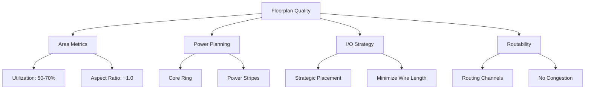

<summary>🏗️ Day 2 — Floorplanning Fundamentals</summary>
<br>
Understanding good vs bad floorplans, library cell architecture, and die/core planning.

## 📑 Table of Contents

1. [Floorplan Fundamentals](#1-floorplan-fundamentals)
2. [Floorplan Configuration & Execution](#2-floorplan-configuration--execution)
3. [Analyzing and Visualizing Floorplan Results](#3-analyzing-and-visualizing-floorplan-results)

---

## 🎯 Welcome to Day 2!

Yesterday, we completed synthesis and obtained our gate-level netlist. Today, we're taking the next exciting step—**Floorplanning**! This is where we decide how to organize our chip's real estate. Think of it as being an architect planning where each room goes in a house before construction begins! 🏗️

A good floorplan can make or break your design—it affects timing, power consumption, and even whether your chip will work at all!

---

## 1. Floorplan Fundamentals

### 🗺️ What is Floorplanning?

Floorplanning is the foundation of physical design where we:
- 📐 Define chip dimensions (die area and core area)
- ⚡ Plan power distribution networks (PDN)
- 📍 Place I/O pins strategically
- 🎯 Reserve areas for macros and standard cells

> 💡 **Think of it this way:** If your chip is a city, floorplanning is urban planning—deciding where roads, power lines, and buildings go before construction begins!

### 🎯 Floorplan Quality Metrics



**Key Formulas:**

```
Utilization Factor = (Area occupied by cells / Total core area) × 100%

Aspect Ratio = Height of Core / Width of Core

Good Floorplan = {Utilization: 50-70%, Aspect Ratio: 0.8-1.2, No congestion}
```

---

### ✅ Good vs Bad Floorplan

| Aspect | ✅ Good Floorplan | ❌ Bad Floorplan |
|--------|------------------|------------------|
| **📏 Utilization** | 50-70% (routing space available) | >80% (no routing space) |
| **📐 Aspect Ratio** | 0.8-1.2 (balanced) | >2.0 or <0.5 (timing skew) |
| **🔌 I/O Placement** | Strategic, near related logic | Random, crisscross connections |
| **⚡ Power Grid** | Core ring + adequate stripes (~150µm pitch) | Sparse, large pitch (IR drop) |
| **🎯 Macro Placement** | Based on connectivity | Blocking routing channels |
| **🛣️ Routing Channels** | Adequate space between rows | Congestion hotspots |
| **📦 Core Margin** | 2-5µm from die edge | Cells touching edge |

### ⚠️ Floorplan Red Flags

```
🚨 DANGER SIGNS:
   ├── Utilization > 85% → Routing nightmare ahead!
   ├── Aspect Ratio > 2.0 → Timing closure impossible
   ├── Overlapping macros → Physical violation
   ├── IR drop > 10% → Reliability failure
   └── Congestion > 80% → Design will not route
```

---

## 2. Floorplan Configuration & Execution

### 🎛️ Essential Floorplan Switches

#### Core Configuration Parameters

| Switch | Purpose | Typical Value | Impact if Wrong |
|--------|---------|---------------|-----------------|
| **🔲 `FP_CORE_UTIL`** | Core area filled with cells | **50-60%** | Too high = No routing space<br>Too low = Wasted area |
| **🟪 `FP_ASPECT_RATIO`** | Core height/width ratio | **1.0 (square)** | Extreme values = Timing skew |
| **⚖️ `FP_SIZING`** | Relative (auto) or absolute sizing | `"relative"` | Wrong mode = Area mismatch |
| **📐 `DIE_AREA`** | Die boundary coordinates | `"0 0 1000 1000"` | Only with absolute sizing |

#### I/O Configuration

| Switch | Purpose | Typical Value | Impact if Wrong |
|--------|---------|---------------|-----------------|
| **🔌 `FP_IO_MODE`** | I/O pin placement pattern | `0` = matching<br>`1` = random | Poor timing, access issues |
| **🧭 `FP_IO_HMETAL`** | Horizontal I/O metal layer | **4** (Metal4) | DRC, routing issues |
| **🧭 `FP_IO_VMETAL`** | Vertical I/O metal layer | **3** (Metal3) | Layer mismatch |
| **🧱 `FP_CORE_MARGIN`** | Core to die edge spacing | **2-5 µm** | Too small = No power ring |

#### Power Planning

| Switch | Purpose | Typical Value | Impact if Wrong |
|--------|---------|---------------|-----------------|
| **🔋 `FP_PDN_CORE_RING`** | Enable power ring around core | `1` = Enable | No ring = IR drop issues |
| **♻️ `FP_PDN_AUTO_ADJUST`** | Auto-adjust PDN to fit | `1` = Enable | Manual fixes needed |
| **📏 `FP_PDN_VPITCH`** | Vertical power stripe spacing | **≈150 µm** | IR drop or blockage |
| **📏 `FP_PDN_HPITCH`** | Horizontal power stripe spacing | **≈150 µm** | IR drop or blockage |
| **⚡ `VDD_NETS`** | Power net name(s) | `"vccd1"` or `"VDD"` | Power not connected |
| **⚡ `GND_NETS`** | Ground net name(s) | `"vssd1"` or `"GND"` | Ground not connected |

#### Advanced Configuration

| Switch | Purpose | Typical Value | Impact if Wrong |
|--------|---------|---------------|-----------------|
| **⚙️ `FP_TAPCELL_DIST`** | Distance between tap cells | **14 µm** | Latch-up risk |
| **🧠 `DESIGN_IS_CORE`** | Core or macro block | `1` = Core | Wrong PDN structure |

---

### 📊 Configuration Guidelines

**Utilization Strategy:**
```
├── 40-50% → Low density, easy routing (test chips)
├── 50-60% → Balanced (RECOMMENDED START)
├── 60-70% → High density, careful routing
├── 70-80% → Very tight, expert-level
└── >80%  → DANGER ZONE! Routing failure likely
```

**Aspect Ratio Effects:**
```
├── 0.5 → Very wide (2:1) → Horizontal wire bias
├── 1.0 → Square ✅ → Balanced timing
├── 2.0 → Very tall (1:2) → Vertical wire bias
└── > 2.5 → Extreme! → Severe timing skew
```

---

### 🚀 Running Floorplan in OpenLANE

Execute floorplan:

```tcl
% run_floorplan
```


**What's happening:**
- ✅ OpenLANE executing floorplan stages
- 📊 I/O placement, tap cell insertion, PDN generation
- ⚡ Die dimensions calculated based on configuration
- 🎯 Standard cell rows created
- ⏱️ Execution time displayed for each sub-step

**Success Indicators:**
- No errors in log
- Die area calculated successfully
- I/O pins placed without violations
- Tap cells inserted properly

---

## 3. Analyzing and Visualizing Floorplan Results

### 📊 Floorplan Results Analysis

#### Default Configuration Reference

**Location:** `$OPENLANE_ROOT/configuration/floorplan.tcl`


**Contains:**
- 📋 Default values for all switches
- 🔧 Core utilization, aspect ratio defaults
- ⚡ PDN configuration defaults
- 🔌 I/O placement defaults
- 🎯 Fallback values if not overridden

---

#### I/O Placer Log Analysis

**Location:** `logs/floorplan/ioPlacer.log`


**Information provided:**
- 🔌 I/O pin placement algorithm details
- 📍 Pin distribution around die
- ⚙️ I/O placement mode used
- 🧭 Metal layers assigned to pins
- ✅ Verification of successful placement

**Check for:**
- All I/O pins accounted
- No placement violations
- Correct metal layers
- Adequate pin spacing

---

#### DEF File (Design Exchange Format)

**Location:** `results/floorplan/picorv32a.floorplan.def`


**Key Information:**

| Element | Description | Format |
|---------|-------------|--------|
| **DIEAREA** | Die boundary coordinates | `(llx lly) (urx ury)` |
| **UNITS** | Database unit definition | `DISTANCE MICRONS 1000` |
| **COMPONENTS** | Placed instances count | Number of cells |
| **PINS** | I/O pin count | Number with coordinates |
| **ROWS** | Standard cell row definitions | Origin, orientation, spacing |

**Verification checklist:**
- Die area matches expectations
- Core area has proper margin
- All I/O pins present with valid coordinates
- Row definitions correct

---

### 📈 Key Metrics Extraction

```
📊 Floorplan Quality Metrics:
   ├── 📐 Die Area (µm²) = Width × Height
   ├── 📦 Core Area (µm²) = Area for cells
   ├── 🎯 Utilization (%) = (Cell area / Core area) × 100
   ├── 📏 Aspect Ratio = Core Height / Core Width
   ├── 🔌 Number of I/O pins
   ├── ⚡ Power grid pitch (µm)
   └── 🧱 Core margin (µm)
```

**Calculation from DEF:**
```python
DIE_WIDTH = (urx - llx) / 1000    # Convert to microns
DIE_HEIGHT = (ury - lly) / 1000
DIE_AREA = DIE_WIDTH * DIE_HEIGHT
ASPECT_RATIO = CORE_HEIGHT / CORE_WIDTH
UTILIZATION = (TOTAL_CELL_AREA / CORE_AREA) * 100
```

---

### 🎨 Visualizing with MAGIC Layout Viewer

#### Opening the Floorplan

Navigate to results and launch MAGIC:

```bash
cd designs/picorv32a/runs/[run_folder]/results/floorplan/

magic -T /home/iraj/VLSI/openlane_working_dir/pdks/sky130A/libs.tech/magic/sky130A.tech \
      lef read ../../tmp/merged.lef \
      def read picorv32a.floorplan.def &
```

---

#### Full Chip View


**Visual Elements:**

| Color/Element | Represents | Significance |
|---------------|-----------|--------------|
| 🟦 **Blue/Purple** | Standard cell placement regions | Where cells will be placed |
| 🟥 **Red lines** | Metal layers (routing) | Available routing resources |
| 🟨 **Yellow rectangles** | I/O pins at periphery | External connection points |
| ⚪ **White space** | Routing channels | Critical for successful routing |
| 🎯 **Grid pattern** | Placement sites | Legal cell positions |
| **Black outline** | Die boundary | Physical chip edge |

**Navigation:**
- **Center design:** Press `S` (select all) then `V` (view all)
- **Zoom in:** Left-click & drag to select, press `Z`
- **Zoom out:** Press `Shift + Z`
- **Return to full view:** Press `V`

---

#### Essential MAGIC Commands

**Basic Navigation:**

| Command | Action | Usage |
|---------|--------|-------|
| **`S`** | Select | Click, then `S` |
| **`V`** | View All | Centers entire design |
| **`Z`** | Zoom In | Select area + `Z` |
| **`Shift+Z`** | Zoom Out | Zoom out one level |
| **`U`** | Undo | Undo last action |

**Inspection Commands:**

| Command | Action | Result |
|---------|--------|--------|
| **`what`** | Query object | Cell name, type, layer info in tkcon |
| **`:box`** | Show dimensions | Box coordinates & dimensions |
| **`I`** | Select instance | Selects entire cell |
| **`B`** | Bounding box | Shows cell boundaries |
| **`X`** | Expand hierarchy | Shows internal structure |

**Display Commands:**

| Command | Purpose |
|---------|---------|
| **`?`** | Show help menu |
| **`G`** | Toggle grid display |
| **`;`** | Open command line |

---

#### Detailed Cell Inspection


**Achieved by:**
1. Zoom into region of interest
2. Hover cursor over cell
3. Press `S` to select
4. Type `what` in tkcon window
5. Information appears below

**Displays:**
- Cell name (decap, tap, filler)
- Layer information (Metal1, Metal2, etc.)
- Cell boundaries and dimensions
- Pin locations

**Verification:**
- ✅ Cells aligned to grid
- ✅ No overlapping cells
- ✅ Proper cell type
- ✅ Correct layer usage

---

### 🔍 Critical Areas to Inspect

```
🔍 Inspection Checklist:
   ├── 🔌 I/O Pins → Location, metal layer, size
   ├── 🎯 Core Boundary → Margin from edge, proper rows
   ├── ⚡ Power/Ground Rings → Width, layers, connectivity
   ├── 🧱 Tap Cells → Spacing (~14µm), row placement
   ├── 📍 Macros (if any) → Position, orientation, blockages
   └── 🟦 Standard Cell Rows → Height, spacing, continuity
```

---

### ✅ Quality Checks

**Dimensional Verification:**
- Die dimensions match specifications
- Core utilization 50-70%
- Aspect ratio reasonable (~1.0)

**I/O Verification:**
- All pins placed successfully
- Logical pin locations
- No congestion
- Correct metal layers

**Power Planning:**
- Core ring present (if enabled)
- Adequate power stripe pitch
- VDD/GND nets connected
- No PDN DRC violations

**Placement Readiness:**
- Standard cell rows defined correctly
- Adequate routing channels
- No blockage overlaps
- Tap cells fit properly

---

### ⚠️ Common Issues and Fixes

| Issue | Symptom | Fix |
|-------|---------|-----|
| **High Utilization** | >80% usage | Increase die size or reduce `FP_CORE_UTIL` |
| **No Core Margin** | Cells at die edge | Set `FP_CORE_MARGIN` properly |
| **I/O Pin Overlap** | Pins too close | Adjust I/O mode or placement |
| **Missing Power Ring** | No ring visible | Enable `FP_PDN_CORE_RING` |
| **Wrong Aspect Ratio** | Very tall/wide | Adjust `FP_ASPECT_RATIO` |

---

## 💡 Key Takeaways

- 🎯 Good floorplan balances utilization (50-70%), aspect ratio (~1.0), and routability
- 📐 Configuration switches control critical parameters: core utilization, I/O placement, power planning
- 🔍 Analysis requires checking DEF files, logs, and visual inspection in MAGIC
- ⚡ Power planning must include core rings and adequate stripe spacing
- ✅ Verification before placement prevents costly downstream issues

---

*"A good floorplan is like a good foundation—you don't see it in the final product, but without it, everything crumbles!"* 🏗️
